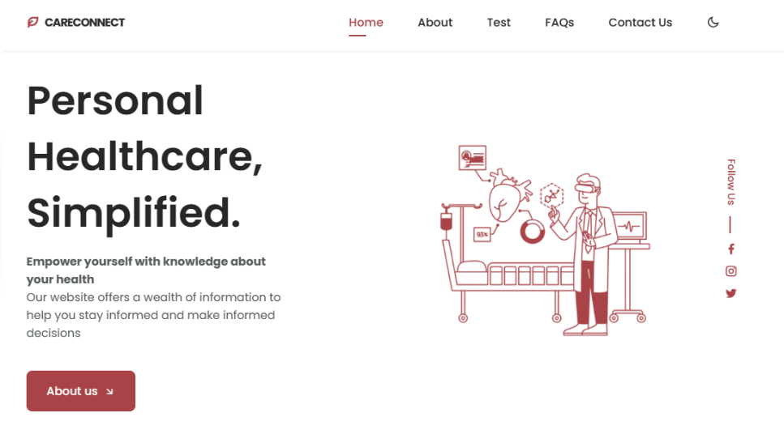
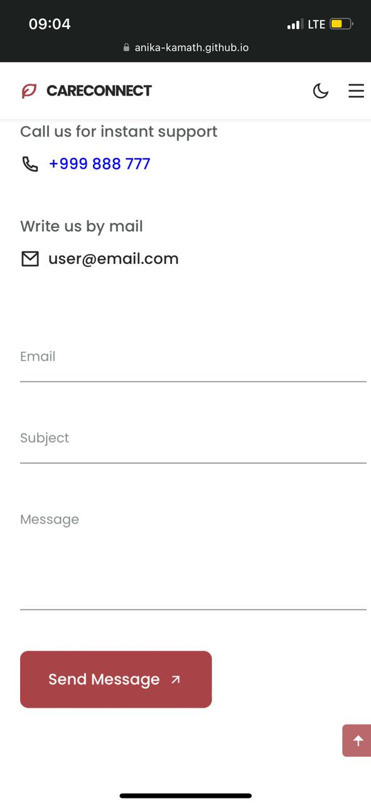

# CareConnect CKD Portal 🧑‍⚕️

## 35% Implementation done already:
- To determine if a patient is likely to be diagnosed with chronic kidney disease (CKD) or not, we created a machine learning model with a 99.7% accuracy rate, based on easily available parameters from accessible sources such as blood test reports.
- We have created a website for our CareConnect portal that has a user-friendly interface and tracks patient data. The User Interface elements for diagnosis reports, basic tracker, features, contact forms, navigation bar are ready to use.
- A UI component that enables patients to get in touch with medical professionals in their area has been implemented.
- The portal is completely responsive and embedded with our machine learning model in the backend at this stage.

---

## Things to be implemented:
- User authentication and authorization for secure login and access control.
- Database integration to store user data, reports, and appointments.
- Data visualization to display user past reports and current stage in an understandable format.
- Integration with external APIs for real-time access to healthcare data and resources.
- Tracker analyser system to track basic necessities to maintain kidney health, such as nutrients, fluids, meditations and workouts.
- Integration of tracker elements with wearable OS, such as FitBits and Apple Watches: MockUp components

## Preview
- Web Version

- Mobile Version

